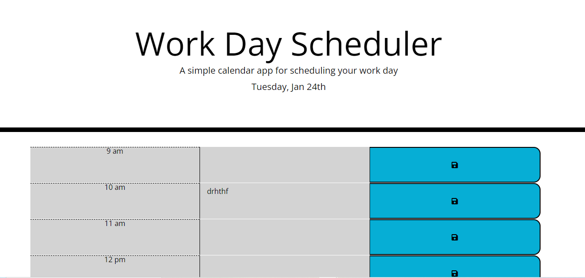

# Third-Party APIs: Work Day Scheduler

## My Task
My task for this week was to create a work day scheduler that would save  a users events as planned in order to effectively manage time.

## User Story

The user story given was:

```md

AS AN employee with a busy schedule
I WANT to add important events to a daily planner
SO THAT I can manage my time effectively
```

## Acceptance Criteria

The app should:

* Display the current day at the top of the calender when a user opens the planner.
 
* Present timeblocks for standard business hours when the user scrolls down.
 
* Color-code each timeblock based on past, present, and future when the timeblock is viewed.
 
* Allow a user to enter an event when they click a timeblock

* Save the event in local storage when the save button is clicked in that timeblock.

* Persist events between refreshes of a page


## Picture of application



## Link to application

The following link connects to the application. Link here: A link to the application can be found [Work Day Scheduler....](https://ope079.github.io/Code-Quiz/)